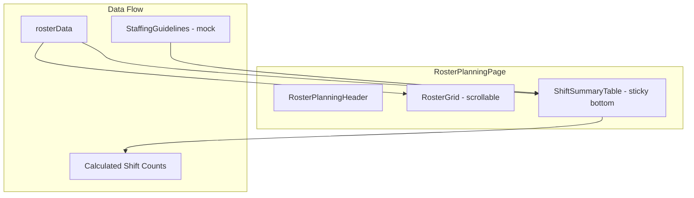

# Sticky Shift Summary Table Implementation

## Overview

Add a sticky summary table at the bottom of the roster planning page that shows shift counts (A/P/N) per day, broken down by role (RN/EN/HCA), with color-coded cells based on minimum staffing requirements.

## Architecture



## Key Files

| File | Purpose ||------|---------|| [`frontend/src/components/NurseManager/RosterTable/ShiftSummaryTable.tsx`](frontend/src/components/NurseManager/RosterTable/ShiftSummaryTable.tsx) | New component - sticky summary table || [`frontend/src/components/NurseManager/RosterTable/types.ts`](frontend/src/components/NurseManager/RosterTable/types.ts) | Add types for staffing guidelines || [`frontend/src/components/NurseManager/RosterTable/staffingGuidelines.ts`](frontend/src/components/NurseManager/RosterTable/staffingGuidelines.ts) | New file - mock staffing requirements data || [`frontend/src/routes/nurse-manager/roster-planning.tsx`](frontend/src/routes/nurse-manager/roster-planning.tsx) | Integrate ShiftSummaryTable || [`frontend/src/components/NurseManager/RosterTable/index.ts`](frontend/src/components/NurseManager/RosterTable/index.ts) | Export new component |

## Implementation Details

### 1. Types (in `types.ts`)

```typescript
// Role categories for summary
export type StaffRole = 'RN' | 'EN' | 'HCA';

// Staffing requirements per shift type per role
export interface ShiftRequirement {
  minimum: number;
  maximum?: number;
}

export interface DailyStaffingGuideline {
  RN: { A: ShiftRequirement; P: ShiftRequirement; N: ShiftRequirement };
  EN: { A: ShiftRequirement; P: ShiftRequirement; N: ShiftRequirement };
  HCA: { A: ShiftRequirement; P: ShiftRequirement; N: ShiftRequirement };
}
```

### 2. Mock Staffing Guidelines

Create `staffingGuidelines.ts` with mock minimum requirements:

- RN: min 4-6 per shift type
- EN: min 2 per shift type  
- HCA: min 2 per shift type

**When the real guidelines file is ready, add it to:** `frontend/src/data/staffingGuidelines.json` or update `staffingGuidelines.ts` to fetch from API.

### 3. ShiftSummaryTable Component

- Calculate shift counts from `rosterData` grouped by role and shift type (A/P/N)
- Map nurse designations to roles:
- "Registered Nurse" -> RN
- "Enrolled Nurse" -> EN
- "Healthcare Assistant", "Senior Nursing Aide" -> HCA
- Display sticky footer table with columns matching day columns
- Color cells: green (at/above minimum), red (below minimum)
- Show "Total" row summing all roles

### 4. Layout Structure

```javascript
+----------------------------------+
| RosterPlanningHeader             |
+----------------------------------+
| Scrollable Content Area          |
|   +----------------------------+ |
|   | RosterGrid                 | |
|   | (scrolls vertically)       | |
|   +----------------------------+ |
+----------------------------------+
| ShiftSummaryTable (sticky)       |
| +-----+-----+-----+-----+-----+  |
| |     | Mon | Tue | Wed | ... |  |
| | RN  | 6   | 4   | 6   | ... |  |
| | EN  | 1   | 2   | 1   | ... |  |
| | HCA | 2   | 2   | 1   | ... |  |
| |Total| 10  | 8   | 10  | ... |  |
| +-----+-----+-----+-----+-----+  |
+----------------------------------+


```